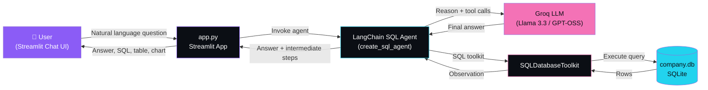
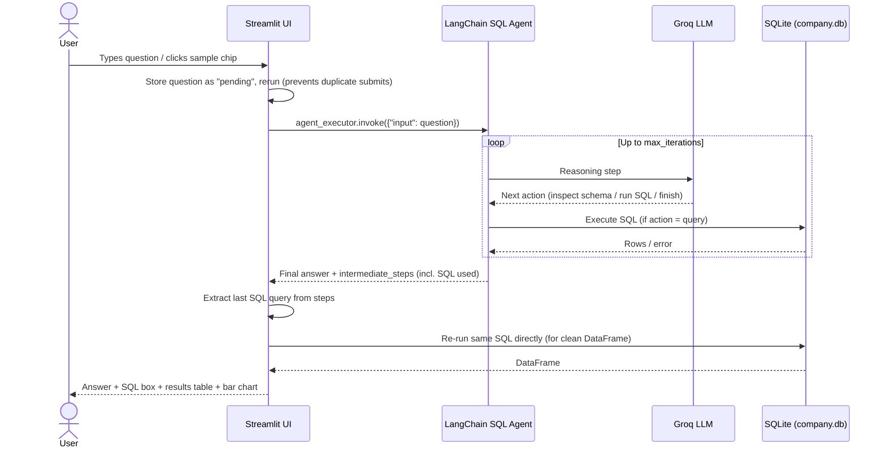
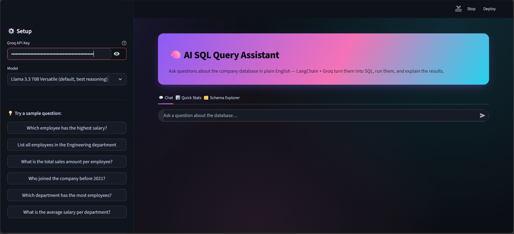
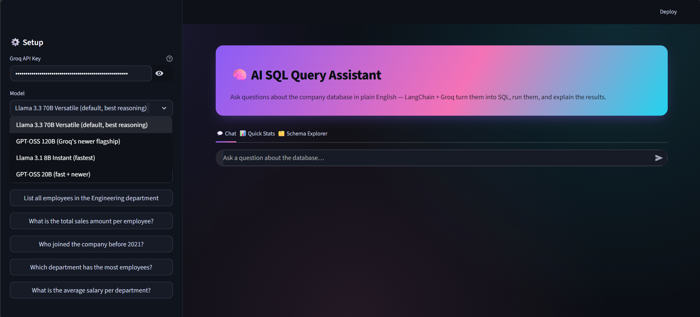
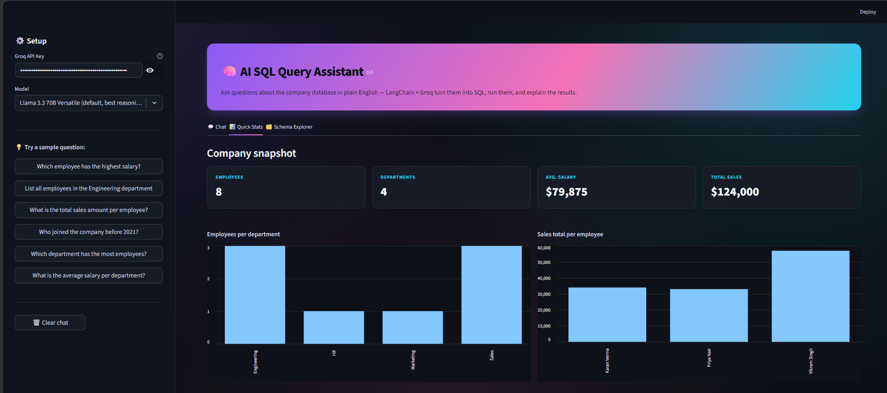
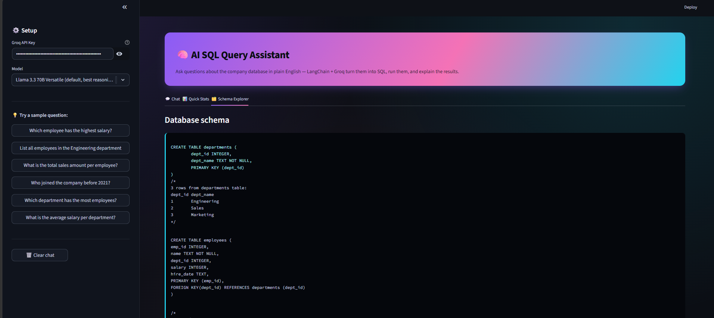
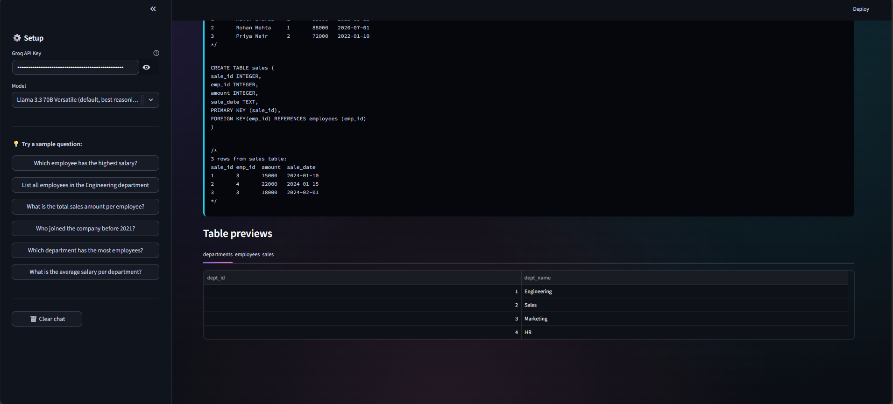
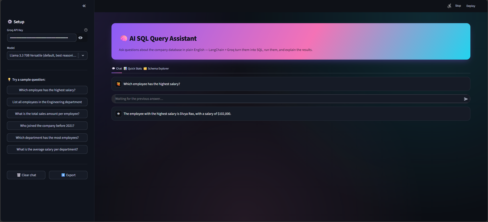
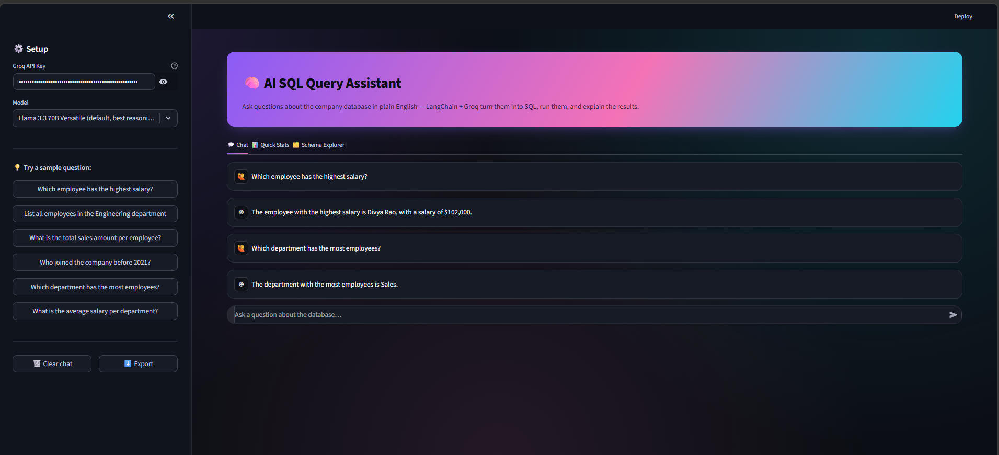
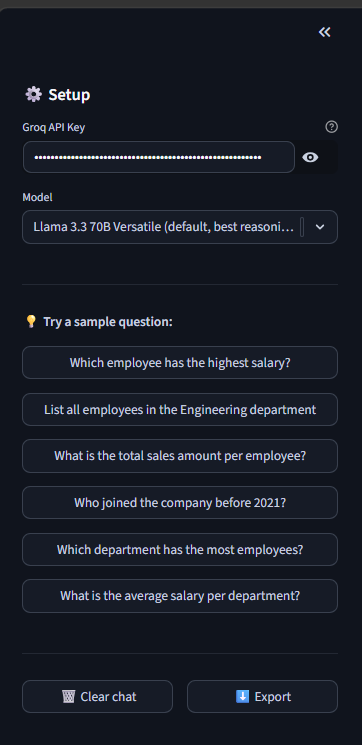

# 🧠 AI SQL Query Assistant

Ask questions about a company database in **plain English** — no SQL knowledge required.
This app uses **LangChain** + **Groq** (free, fast LLM inference) to translate natural
language into SQL, execute it against a live SQLite database, and return the answer
alongside the generated query, a results table, and auto-generated charts.

---

## ✨ Features

- 💬 **Natural language → SQL** — ask questions like *"Which employee has the highest salary?"* and get a real answer, not just a query
- 🔍 **Transparent SQL** — every generated query is shown, so you can verify exactly what ran
- 📊 **Auto-visualization** — numeric results are automatically charted
- 📈 **Quick Stats dashboard** — at-a-glance company metrics (headcount, avg. salary, total sales)
- 🗂️ **Schema Explorer** — browse table structure and preview raw data
- 🧠 **Multiple model choices** — switch between Llama 3.3 70B, GPT-OSS 120B/20B, and Llama 3.1 8B (all via Groq)
- 📥 **Exportable chat history** — download your Q&A session as a text transcript

---

## 🏗️ Architecture



**Components:**

| Layer | Technology | Responsibility |
|---|---|---|
| UI | Streamlit | Chat interface, tabs, charts, styling |
| Orchestration | LangChain (`create_sql_agent`) | Decides which SQL tool calls to make, iterates until it has an answer |
| LLM | Groq API (Llama 3.3 70B / GPT-OSS / Llama 3.1 8B) | Converts natural language → SQL reasoning, and SQL results → natural language answer |
| Toolkit | `SQLDatabaseToolkit` | Exposes schema-inspection and query-execution tools to the agent |
| Data | SQLite (`company.db`) | Stores `employees`, `departments`, `sales` tables |

---

## 🔄 Workflow (request lifecycle)



---


## ⚙️ Setup & Installation

### 1. Clone the repository
```bash
git clone https://github.com/<your-username>/<your-repo-name>.git
cd <your-repo-name>
```

### 2. Create a virtual environment (recommended)
```bash
python -m venv venv
source venv/bin/activate        # On Windows: venv\Scripts\activate
```

### 3. Install dependencies
```bash
pip install -r requirements.txt
```

### 4. Generate the sample database
```bash
python create_db.py
```
This creates `company.db` with sample `employees`, `departments`, and `sales` data.

### 5. Get a free Groq API key
Sign up at [console.groq.com](https://console.groq.com) and generate an API key.

### 6. Run the app
```bash
streamlit run app.py
```
Paste your Groq API key into the sidebar when the app opens in your browser.

---

## 🗄️ Database Schema

| Table | Columns |
|---|---|
| `departments` | `dept_id`, `dept_name` |
| `employees` | `emp_id`, `name`, `dept_id`, `salary`, `hire_date` |
| `sales` | `sale_id`, `emp_id`, `amount`, `sale_date` |

---

## 🧪 Sample Questions to Try

- *Which employee has the highest salary?*
- *List all employees in the Engineering department*
- *What is the total sales amount per employee?*
- *Who joined the company before 2021?*
- *Which department has the most employees?*
- *What is the average salary per department?*

---

## 🖼️ Screenshots

| | | |
|---|---|---|
|  |  |  |
|  |  |  |
|  |  | |

> Screenshots live in the `Screenshots/` folder (capital S) at the project root.
---

## 🎥 Demo

[▶️ Watch the demo](Langchain_demo.mp4)

> The demo video is at the repo root as `Langchain_demo.mp4`, not inside a `demo/` subfolder.

## 🛠️ Tech Stack

- **Frontend/UI:** Streamlit
- **LLM Orchestration:** LangChain (`langchain`, `langchain-community`)
- **LLM Provider:** Groq (`langchain-groq`) — Llama 3.3 70B, GPT-OSS 120B/20B, Llama 3.1 8B
- **Database:** SQLite (via SQLAlchemy)
- **Data handling:** Pandas

---

## ⚠️ Notes & Limitations

- The Groq API key is entered in the UI and used only for that session — it is **never** written to disk or committed to the repo.
- The agent only executes `SELECT`-style queries surfaced through the SQL toolkit; the app additionally re-runs and validates the query as read-only before rendering a DataFrame.
- This is a demo/sample project using a small in-memory-style SQLite database — not intended for production workloads or untrusted multi-user database access.

---

## 📄 License

Add a license of your choice (e.g. MIT) by creating a `LICENSE` file at the project root.

---

## 🙋 Author

AFROSE FATHIMA J
